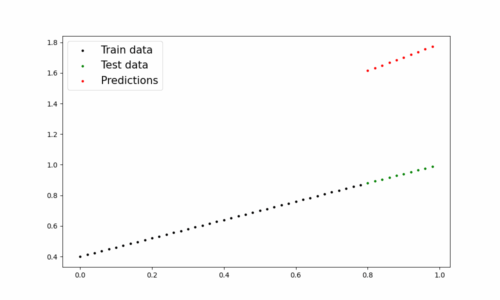

# 📈 Simple Linear Regression with PyTorch

This project demonstrates a minimal implementation of **linear regression using PyTorch** — built from scratch with clear code, visualization, and animation of the training process.



---

## 💡 What it Does

- Implements a basic linear regression model using `torch.nn.Module`
- Trains on generated data using **MSE loss** and **SGD optimizer**
- Visualizes predictions vs actual data points
- Exports a GIF that shows how predictions improve over training epochs

---

## 🧪 Key Features

- 🔁 Custom training loop
- 📉 Real-time loss tracking
- 📊 Scatter plot GIF to visualize training progress
- 🧠 Uses `torch.nn.Parameter` to manually define weights and bias

---

## 📂 Files Included

- `linear_regression_with_torch.ipynb` — main code notebook
- `training_scatter.gif` — training progress animation
- `README.md` — project overview

---

## 🚀 How to Run

### 1. Install requirements
```bash
pip install torch matplotlib imageio pillow


